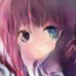
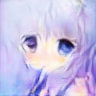
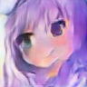

# A GAN Demo: ACG-Style Faces Generating
## Introduction
Try to build a GAN to generate ACG-style faces. I can pick some out as my SNS avatar, maybe...(if I make it :D)

## Prerequisite
### Codes
* main.py
* gan.py
* utils.py
* generate.py
* dcgan.py
* nets.py
* show.html
* show.js
* spider.py

`main.py` is for training, predicting process controlling. `gan.py` is for net construction. `utils.py` is for other tool functions. `generate.py` is for generating face images. `dcgan.py` and `nets.py` are rebuild versions of `main.py` and `gan.py` (not complete). `show.html` and `show.js` are for future presentation on web via Keras.js. `spider.py` is for downloading training datas, thanks for the provider Acokil! 

### Datasets
Downloaded from the Internet, thanks for the data provider!
* faces.zip
* hqface.zip

`faces.zip` is an ACG-style avatar images dataset with image size of (96, 96, 3) They are collected from a well-known ACG image website [Konachan](http://konachan.net "Konachan~").

`hqface.zip` is also collected from Konachan, but I only picked images of higher quality.

All images in the dataset have been reshaped to appropriate sizes. They are all ACG-style face images.

## Evironment
### OS
* Linux CentOS
* Windows 10

The linux server mainly serves as training platform. Win10 is for coding.

### GPU
* Nvidia 920MX
* Nvidia Tesla K40M

920MX is my laptop's GPU, which may not be actully used in this demo.

K40M is from ZJUSPC. Thanks for the authorization of the usage of K40M from ZJUSPC!

## References
Code references: [GAN-Zoo](https://github.com/hindupuravinash/the-gan-zoo)

Paper references: 
* [Generative Adversarial Nets](https://arxiv.org/abs/1406.2661v1) (arxiv id: 1406.2661v1)
* [Conditional Generative Adversarial Nets](https://arxiv.org/abs/1411.1784v1) (arxiv id: 1411.1784v1)
* [Unsupervised Representation Learning with Deep Convolutional Generative Adversarial Networks](https://arxiv.org/abs/1511.06434v2) (arxiv id: 1511.06434v2)

## Results
Here are some generated avatars. I used a 300-d noise as input and trained for 40k epoches. In each epoch, I used 64 training images to feed the model.

            

As you can see, the quality of these avatars is not good enough. In fact, for most of the generated images you can only recognize blurry faces so I just picked out some well-performed results. It is hard but worth to improve the model's performance.

## Future
Try to improve performance via these approaches:
* Use high quality training images
* Use larger training images
* Try CGAN (add conditions)

I used a web spider (from Acokil, thank you again!) to download more images and scale each of them to a size of (112, 112, 3), a little bit larger than before. Then I adjusted the GAN and trained a new model. It performs better on generating higher-resolution and more-specific-boundary avaters.

Here are some new examples generated by the new GAN.
      